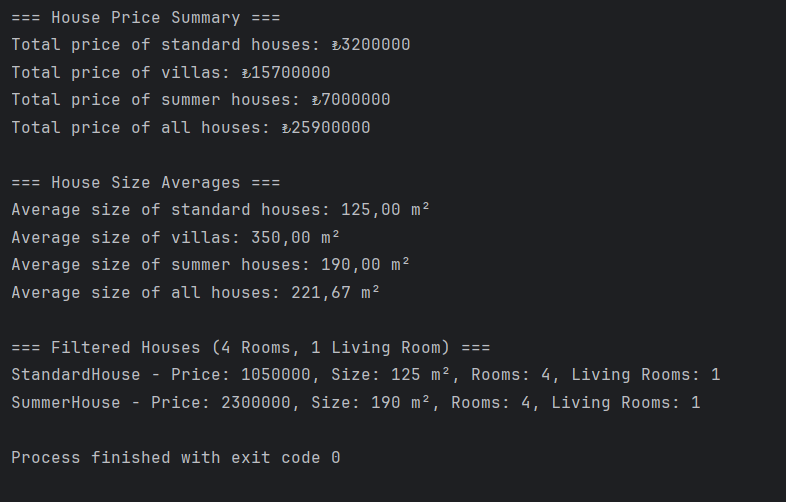

# Home Service Project 🏡
> **Note:** This project was created as a homework assignment for the Getir Java Bootcamp.

## 🧱 Project Structure

The project follows a layered architecture with separation of concerns:

```
src
└── main
    └── java
        └── org.kaankarakas
            ├── model          → Contains entity classes: House, Villa, SummerHouse, etc.
            ├── repository     → Contains HouseRepository class for mock data
            ├── service
            │   ├── impl       → Business logic implementation (HouseServiceImpl)
            │   └── HouseService.java → Interface
            └── main
                └── Main.java  → Main entry point of the application
```

## 🚀 How to Run

1. Clone the repository.
2. Open the project in an IDE like IntelliJ IDEA or Eclipse.
3. Navigate to the `Main.java` file.
4. Run the `main` method.

```bash
cd src/main/java/org/kaankarakas/main
Run Main.java
```
## 📌 Example Output


